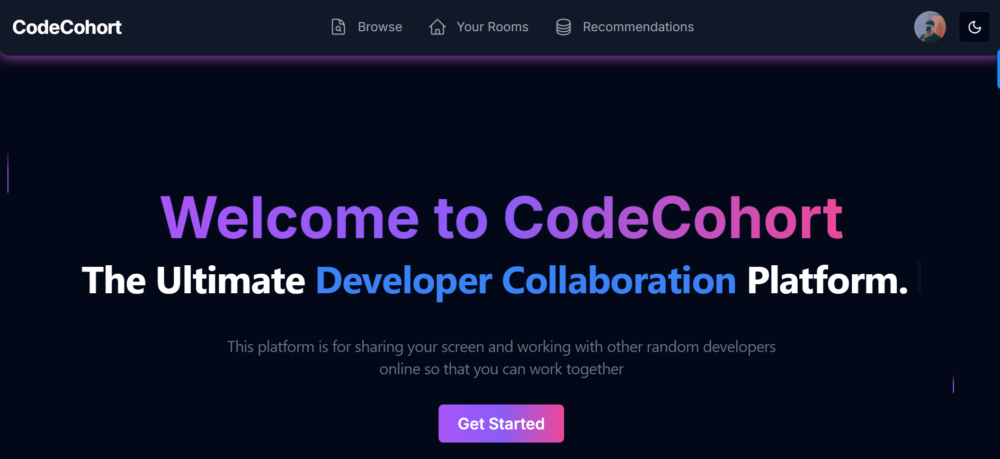
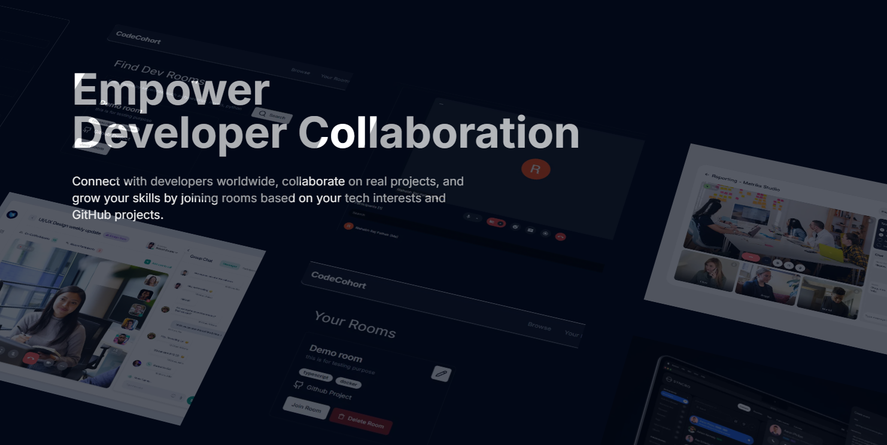
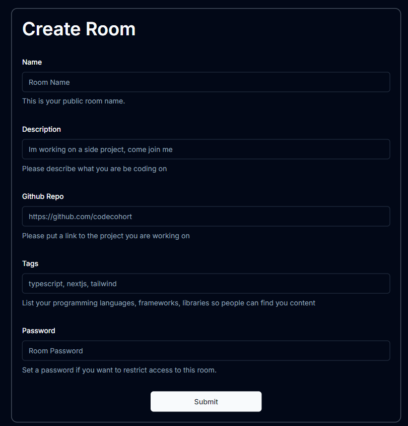
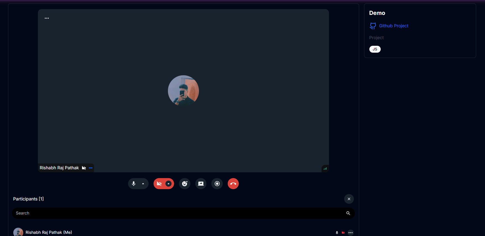
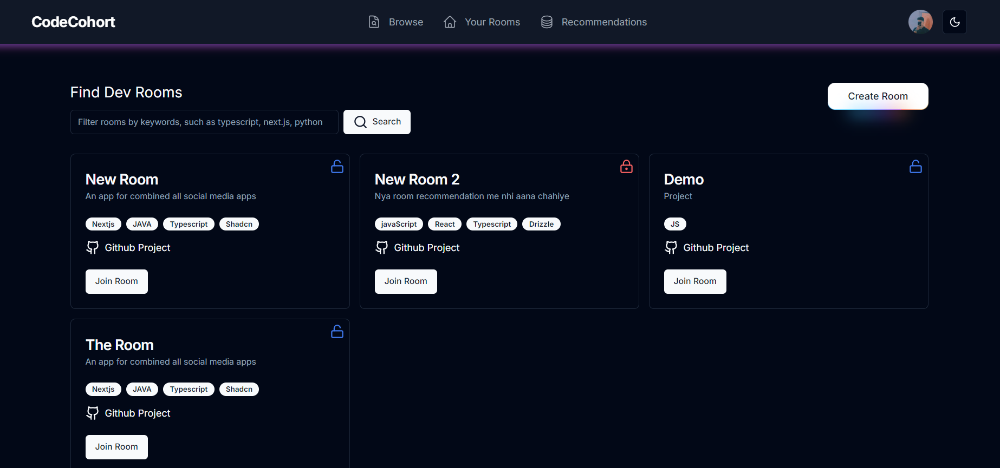
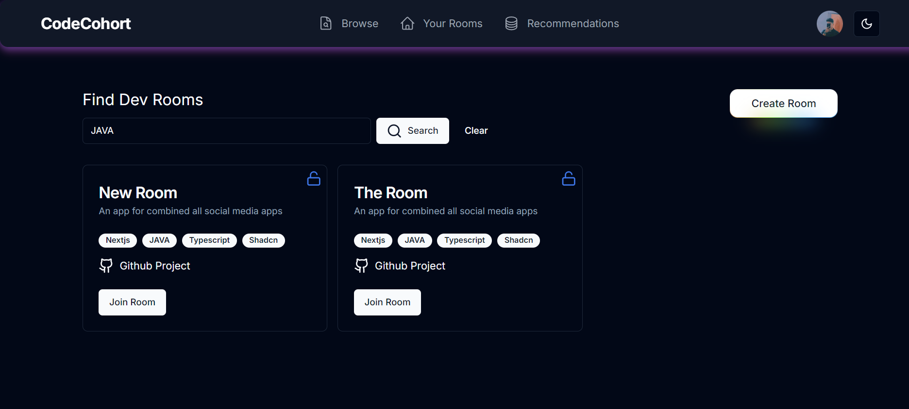
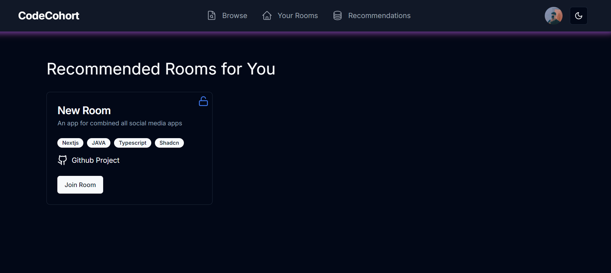
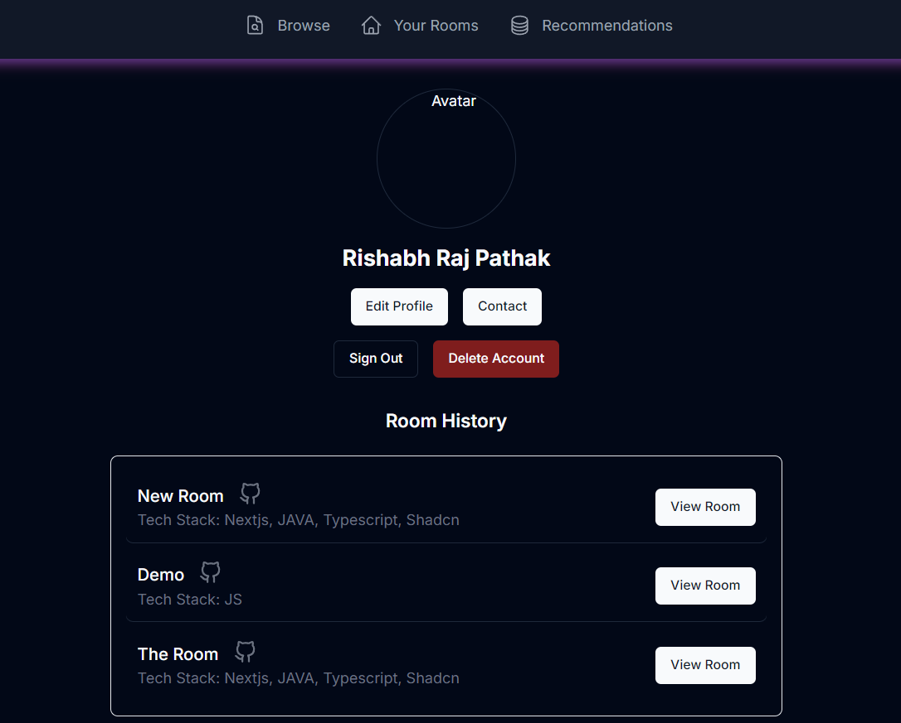

# Developer Collaboration Platform

A platform designed specifically for developers to collaborate on projects, similar to Omegle, but with features tailored for project development. The platform allows users to create and join rooms, discuss projects, and collaborate using GitHub integration and real-time communication.

---

## Table of Contents

1. [Project Overview](#project-overview)
2. [Key Features](#key-features)
   - [Creating Rooms](#creating-rooms)
   - [Browsing Rooms](#browsing-rooms)
   - [Searching Rooms by Tags](#searching-rooms-by-tags)
   - [Room Recommendations](#room-recommendations)
   - [User Profile](#user-profile)
3. [Security Measures](#security-measures)
4. [Tech Stack](#tech-stack)
5. [Installation Instructions](#installation-instructions)
6. [Screenshots](#screenshots)

---

## Project Overview

This platform is a collaborative environment where developers can create and join rooms to discuss and work on various projects. By integrating GitHub and offering features like tag-based searches and room recommendations, it aims to foster collaboration and enhance project development. With security features like password encryption and interest-based suggestions, the platform ensures a safe and efficient workspace for developers.

---

## Key Features

### Creating Rooms

- **GitHub Integration**: Developers can create a room by pasting the link of their GitHub project, automatically associating the project with the room.
  
- **Tags**: Users can add relevant tags to describe the technologies, frameworks, and languages used in the project (e.g., `React`, `Node.js`, `Python`).

### Browsing Rooms

- **Homepage**: Upon login, users are presented with a list of available rooms.
  
- **Room Information**: Each room displays key details such as:
  - Number of users currently in the room
  - Tags describing the project
  - The GitHub link for the project
  
- **Room Locking**: Users can lock rooms with a password, and those attempting to join must enter the correct password to access the room.

### Searching Rooms by Tags

- **Tag-Based Search**: Developers can search for rooms using specific tags (e.g., a tech stack like `React` or `Machine Learning`).
  
- **Search Results**: The platform displays a list of rooms that match the selected search criteria.

### Room Recommendations

- **Interest-Based Suggestions**: The platform suggests rooms based on users' interests and past activities to enhance collaboration and engagement.

### User Profile

- **Room History**: Users can view a history of all the rooms they've joined or created.
- **Project Contributions**: Users can see a list of their contributions to various projects within the platform.

---

## Security Measures

### Secure Logins

- **Password Encryption**: All user passwords are encrypted to ensure secure logins.

### Room Recommendations

- **Interest-Based Suggestions**: The platform suggests rooms based on users' interests and past activities to enhance collaboration and engagement.

### User Grouping

- **Skill-Based Grouping**: Users are grouped based on their skills and interests, helping them find like-minded collaborators for their projects.

---

## Tech Stack

### Frontend

- **Next.js**: Framework for building the frontend of the platform.
- **Shadcn**: UI components library for building the user interface.
- **Tailwind CSS**: Styling framework for creating responsive, customizable designs.
- **TypeScript**: A superset of JavaScript providing type safety and improving developer experience.

### Backend

- **Next.js**: Utilized for server-side functionality and handling API routes.
- **Drizzle ORM**: ORM for interacting with the PostgreSQL database.
- **PostgreSQL**: Relational database to store user data and room information.
- **Docker**: Used to containerize the PostgreSQL database for local development.
- **NextAuth**: Authentication solution to handle user sign-ins and secure logins.
- **Stream API**: Provides real-time video streaming for collaboration.

---

## License

This project is licensed under the MIT License - see the [LICENSE](LICENSE) file for details.

---
